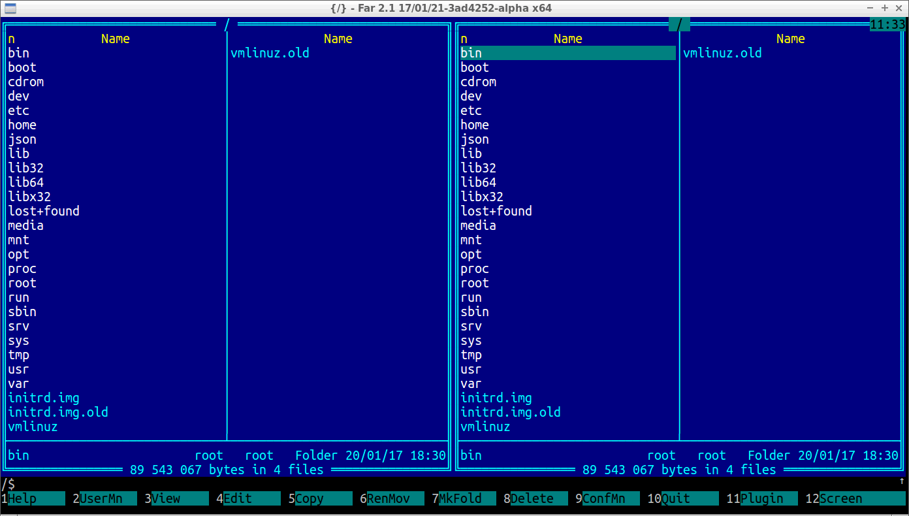
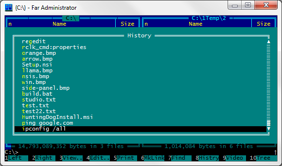
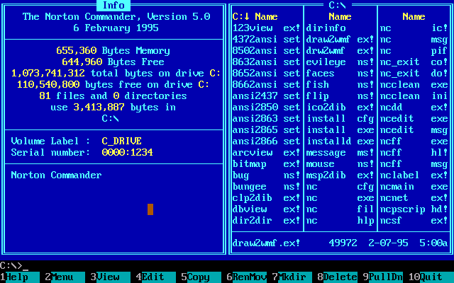

# Far Manager

Far Manager is a keyboard-driven Far File Manager for Windows. Two text panels, function keys, plugins. far manager 3 is the current line. far manager portable is the 7z next to the msi. far manager windows 11 runs in Windows Terminal or the old console.

F5 copies. F6 moves. F7 makes a folder. F4 opens the built-in editor. Tab jumps the other panel. F9 opens the top menu. Ctrl+O hides the panels.

Use the GET badge for this pack. Vendor builds are on farmanager.com. Pick x64 for a 64-bit PC. far manager portable is the archive. The msi is the installed copy.

## Where to start

Open Far Manager. You see two directories. The active panel has the cursor. Copy goes from the active side to the passive side.

This pack is a handbook, not a second shop. Mirrors on download portals are not Far Group.

Main frame sample is [fmain.pas](fmain.pas). Panel host is [MainFrame.java](panel/MainFrame.java). Folder panel is [FolderPanel.java](panel/FolderPanel.java).

A first day list: Downloads on the left, a project tree on the right. Copy a file with F5. That is Far File Manager.

Do not paste a machine-local loop address into a panel. Store a drive path or a plugin URL the plugin understands.

## Features

- Dual panels in text mode
- Keyboard first: F3 view, F4 edit, F5 copy
- far manager plugins as DLL modules
- Built-in text editor and hex view
- Archive plugin and FTP plugin in the stock set
- far manager 3 macros
- far manager portable or installed
- Works on far manager windows 11 and older Windows

| Key | Action |
| --- | --- |
| Tab | Other panel |
| F4 | Edit |
| F5 | Copy |
| F9 | Menu |
| Ctrl+O | Hide panels |

| Build | What you get |
| --- | --- |
| far manager 3 msi | Installed Far Manager |
| far manager portable | Folder you can copy |
| x64 | Usual 64-bit host |

Copy engine is [copy.cpp](copy.cpp). File list is [filelist.cpp](panel/filelist.cpp). Panel core is [panel.cpp](panel/panel.cpp).

A plugin can add a panel, a viewer, or a command. The stock zip already has archive and network modules.

## Requirements

Windows is the home of Far Manager. far manager windows 11 and Windows 10 are the daily targets. x64 is the usual binary.

A console that keeps function keys is enough. Windows Terminal works if you do not steal F-keys for tabs. The old conhost still works.

far manager portable needs a writable folder if you save settings next to the exe. A locked Program Files tree may need the user profile store.

CMake list is CMakeLists.txt. Gradle wrapper files are pack manifests. They do not install Far Manager.

Constants sample is RuntimeConstants.java at pack root. Highlight map is dmhigh.json next to it.

## Contribution

File a plugin bug on the Far forum or the Far Group tracker. A language file is a useful patch. Do not send a random mirror zip as a patch.

Discuss is the forum on farmanager.com and the English thread list. Nightly notes sit next to the stable far manager 3 builds.

Command sample is umaincommands.pas under frames/. Job queue is JobsManager.java under job/.

A plugin API change in far manager 3 is a Far Group note. Read that before you rebuild an old DLL.

## Develop

Code for this pack is samples of panels, copy, editor, and plugins. It is not the Far Group tree. The GET badge is the build you run.

Prerequisites for a vendor nightly are on farmanager.com. You do not need a JDK or a Pascal IDE to use Far File Manager.

Code editing of a plugin is a DLL project. Keep the Far headers that match your far manager 3 build.

Settings store is [config.cpp](cfg/config.cpp). Options dialog sample is foptionsbehavior.pas under frames/.

## UI Backends

Far Manager is a text UI. On far manager windows 11 that text sits in Windows Terminal or conhost.

| Host | Notes |
| --- | --- |
| conhost | Classic, F-keys stay |
| Windows Terminal | Watch tab shortcuts |
| far manager portable | Same UI, other folder |

Command line host is [cmdline.cpp](cmdline.cpp). Location bar sample is LocationBar.java under panel/. File view is ufileview.pas under fileviews/.

If a terminal steals Alt+F1, release that shortcut or use F9 menus. Sticky modifiers are a host trick, not a second Far.

Clipboard is the Windows clipboard. OSC tricks are for other hosts. Far Manager talks to Windows.

## Screenshots

People post two blue panels and the editor. The live product is that screen after you press F9.

Editor core is [editor.cpp](editor.cpp). File edit is [fileedit.cpp](editor/fileedit.cpp). Editor frame sample is EditorFrame.java under editor/.

Hex view is a plugin or a mode on a binary. Do not open a huge ISO in the text editor.

A theme is a color set. far manager 3 can load a custom palette. The default is enough to work.

## Used code from projects

Far Group ships Far Manager and the plugin API. Archive and FTP modules in the stock tree come with the zip. This pack keeps one LICENSE for samples.

Archive plugin sample is [ArcPlg.cpp](archive/ArcPlg.cpp). Archive source sample is uarchivefilesource.pas under archive/.

Do not mix a plugin built for Far 2 with far manager 3 unless the author says it loads.

## Useful 3rd-party extras

far manager plugins are the product after the first week. FTP, archive, a better compare, a hex tool.

FTP connect sample is [Connect.cpp](ftp/Connect.cpp). FTP protocol sample is [FTPProtocolProvider.java](ftp/FTPProtocolProvider.java). Plugin hook is [flplugin.cpp](plugin/flplugin.cpp).

A plugin that asks for a password should not log it. Store credentials in the Far user store if the plugin offers that.

Net plugins replace a mapped drive when you only need one session. Unmount from the plugin menu when you are done.

## Community packages & binaries

Official nightlies and stables are Far Group. far manager portable x64 is the usual grab. ARM64 exists for new Windows kits.

A Linux or mac build is not Far Manager on Windows. This pack describes the Windows Far File Manager.

Project file is doublecmd.lpi at pack root. Manifest is doublecmd.exe.manifest. Build gradle is build.gradle. Those files do not replace the Far zip.

## Known issues

On far manager windows 11 a new Terminal profile can hide F-keys. Fix the keys, not the Far version.

A plugin that injects a GUI can steal focus. Close it and stay in the panels.

Two Far copies can share the same settings file if you launch the same folder twice. Use far manager portable in a second folder if you want two profiles.

Cache sample is cache.cpp at pack root. Search dialog sample is SearchDialog.java under search/.

If panels go blank, Ctrl+R refreshes. If a network plugin hangs, close that panel first.

Macro loop is [macro.cpp](macro/macro.cpp). Bookmarks list is BookmarkManager.java under bookmark/.

A .far file in search results is often an archive or a plugin pack, not a document Word opens. Use Far File Manager to open it if it is a Far addon.

## License

Far Manager uses the Far Group license on the official zip. One LICENSE file covers pack samples. Do not add a second LICENSE beside README.

build.gradle and settings.gradle are pack manifests.

## Discuss

The Far forum is the long memory. English and Russian threads both exist. Nightly chatter is not a support contract.

Copy dialog sample is fcopymovedlg.pas under frames/. File job sample is [FileJob.java](job/FileJob.java).

## Related Questions

**What is a good free file manager for Windows?**

Far Manager is one. It is free, open source, and keyboard first. Explorer is still there if you want icons. far manager 3 is the build to get.

**How can I open a .far file?**

If it is a Far addon or archive, open it in Far File Manager or the archive plugin. It is not a Word file. If a page named it .far by mistake, look at the real extension.

**Is file manager a software?**

Yes. A file manager lists disks and folders and copies files. Far Manager is that class: two panels, keys, plugins.

**How do I find my file manager?**

On Windows, Explorer is the default. Far Manager is the one you installed or unpacked. Search Start for Far, or run the exe from the far manager portable folder.

Auth sample is CredentialsManager.java under auth/. Hex sample is hex/editor.cpp.

Do not store a work token in a screenshot of the FTP panel.

A folder that moved still sits in history until you refresh. Far does not invent a new path.

Closing Far does not undo a copy you already ran. Check the other panel.

Sleep keeps the session if the console stays. A Terminal close kills Far. Start it again.

Fast user switch is a second profile. Start Far Manager there if you want the same layout. The first user keeps their own settings.

A VM with no F-keys on the host needs a key map. That is the hypervisor, not a missing far manager 3 feature.

Safe mode may skip some plugins. Tick them in a normal session.

High contrast in Windows does not restyle Far colors. Load a Far palette if you need contrast.

Clicking with a mouse works for people who want it. The product is still the keys.

far manager linux in search is a different host. This pack is Windows Far Manager.

far manager shortcut keys are in the built-in help (F1). Do not print a third-party cheat sheet as the source of truth.

far manager text editor is F4. far manager hex editor is the hex plugin or hex mode. Use the right one.

far manager archive plugin opens zip and the rest the module lists. A broken archive is the file, not Apply.

far manager ftp plugin is a panel. Bookmark the site. Do not type the password into a shared macro.

far manager x64 is the usual far manager windows 11 pick.

far manager open source is Far Group. The GET badge is the build.

far manager tutorial is F1 plus two panels and F5. That is enough for day one.

far manager commands are the F-keys and the command line under the panels. User menu is F2.

Columns view sample is ucolumnsfileview.pas under fileviews/. File source sample is ufilesource.pas under filesources/.

About dialog sample is fAbout.pas under frames/. Brief view is ubrieffileview.pas under fileviews/.

Those files are pack samples. They do not replace Far.exe.

If Explorer is open on the same folder, a copy in Far still wins if you confirm. Two tools can fight over a locked file.

One Far.exe only per settings folder if you hate lock messages.

A custom user menu (F2) can hold a compiler or a git line. Keep the command a drive path.

Nested archives open in a temporary panel. Close that panel when you are done. The temp folder is not your project.

An editor backup file sits next to the file if you set that. Clean it when you mean to.

Sort by name or by time. Time sort is better for a download dump. Name sort is better for source trees.

Separators in the user menu are visual. They are not folders.

Recent folders live in history. Trim it when you stop recognizing names.

far manager windows and far manager windows 11 share one settings tree if you upgrade in place. You do not rebuild associations for the new OS.

Closing the console exits Far. The next Explorer window is not Far. Start Far again from Start or the portable folder.

## Related Search Terms

Far Manager, Far File Manager, far manager windows 11, far manager 3, far manager portable, file-manager, windows, plugins, editor, ftp-client, command-line, lua, ofm, portable, windows-11, dual-pane, archives
